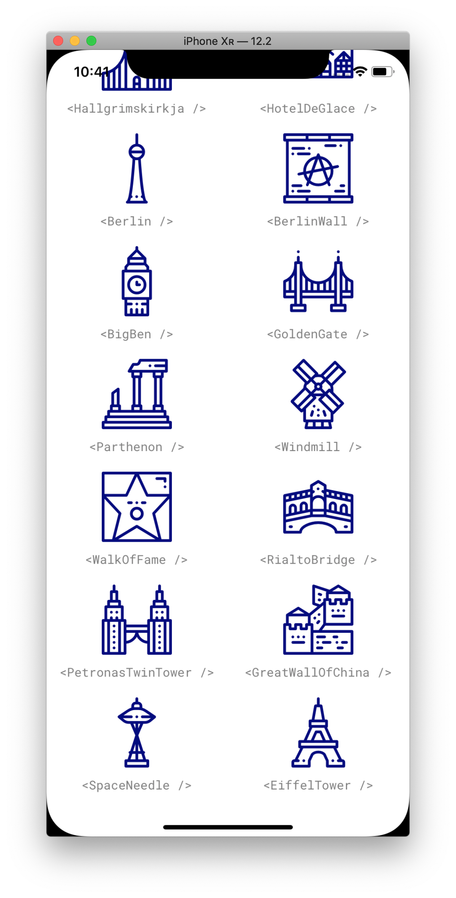

# custom-icons-react-native

This is an example of how to load custom icons into react native without the need to use 3rd party services as Fontello or Icomoon. The icons I choose for the example can be found inside [FlatIcon](https://www.flaticon.com/packs/landmarks-and-monuments-18).

<!-- I wrote an article explaining how it works and the advantages/disadvantages of this approach in case you want to know more.  -->

| Preview 1                          | Preview 2                          | Preview 3                          |
| ---------------------------------- | ---------------------------------- | ---------------------------------- |
|  |  |  |

## Installation

This project relays on [Expo](https://expo.io), therefore first you need to [setup your enviroment](https://docs.expo.io/versions/v32.0.0/introduction/installation/) to be able to preview the project.

```bash
$ git clone https://github.com/EmaSuriano/custom-icons-react-native.git
$ cd custom-icons-react-native
$ yarn
$ yarn start
```

## Relevant Commands

- `yarn start`: Will run expo showcasing the icons as shown above.
- `yarn create-icon`: Will take all the icons inside folder `/assets/icons` , generate the custom font along with the glyph map and create an [index file](/src/Icon/index.js) which contain a React component for each icon.

## License 📝

MIT.
